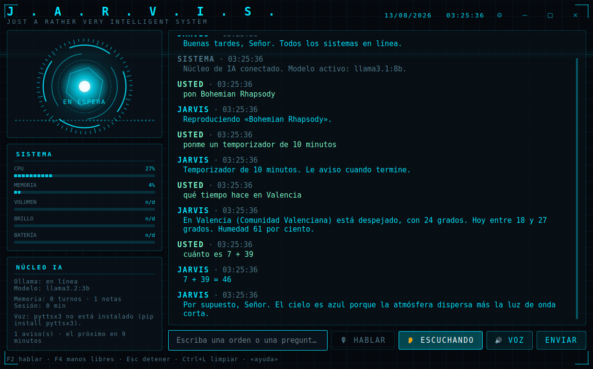
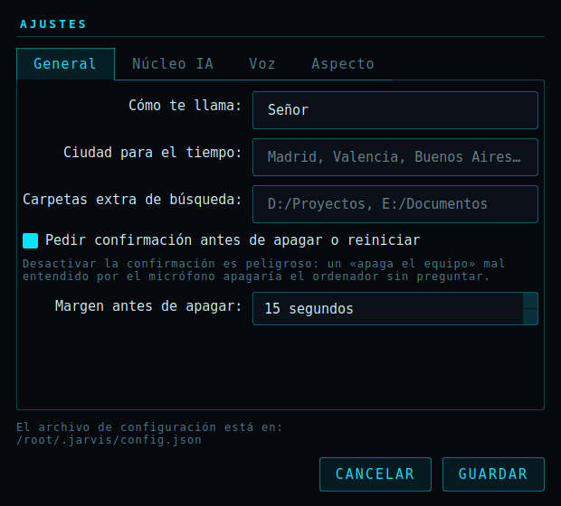

# J.A.R.V.I.S. — Asistente de escritorio para Windows

Un asistente personal que corre **entero en tu ordenador**, sin claves de API ni
servicios de pago. Habla contigo, abre tus programas, busca tus archivos, pone
música, te dice el tiempo, te avisa con temporizadores, controla el volumen y
el brillo, apaga el equipo (pidiéndote confirmación antes) y contesta a
cualquier pregunta usando un modelo de lenguaje local a través de **Ollama**.

Responde por texto o por voz, y en modo manos libres basta con decir
**«Oye JARVIS»**.

Todo dentro de una interfaz estilo Iron Man: fondo oscuro, cian, círculos
animados y un reactor arc que reacciona a lo que está haciendo el asistente.



---

## Índice

1. [Qué sabe hacer](#1-qué-sabe-hacer)
2. [Estructura del proyecto](#2-estructura-del-proyecto)
3. [Instalación paso a paso](#3-instalación-paso-a-paso)
   - [Paso 1 — Instalar Python](#paso-1--instalar-python)
   - [Paso 2 — Descargar el proyecto](#paso-2--descargar-el-proyecto)
   - [Paso 3 — Instalar las librerías](#paso-3--instalar-las-librerías)
   - [Paso 4 — Instalar Ollama](#paso-4--instalar-ollama)
   - [Paso 5 — Elegir y descargar el modelo](#paso-5--elegir-y-descargar-el-modelo)
   - [Paso 6 — Arrancar el programa](#paso-6--arrancar-el-programa-por-primera-vez)
4. [Cómo se usa](#4-cómo-se-usa)
5. [Configuración](#5-configuración)
6. [Problemas comunes](#6-problemas-comunes)
7. [Las pruebas](#7-las-pruebas)
8. [Cómo añadir tus propios comandos](#8-cómo-añadir-tus-propios-comandos)

---

## 1. Qué sabe hacer

| Categoría | Ejemplos de lo que le puedes decir |
|---|---|
| **Abrir programas** | «abre Chrome», «inicia Spotify», «abre la calculadora», «ejecuta Word» |
| **Archivos y carpetas** | «abre la carpeta descargas», «busca el archivo presupuesto», «abre mis documentos» |
| **Páginas web** | «abre YouTube», «abre google.com», «busca gatos en Google» |
| **Música** | «pon Bohemian Rhapsody» (la reproduce de verdad), «pon música», «pausa», «siguiente canción» |
| **El tiempo** | «¿qué tiempo hace?», «el clima en Valencia», «¿va a llover?» |
| **Cuentas** | «cuánto es 7 + 39», «el 20 por ciento de 350», «raíz de 144» |
| **Avisos** ⏰ | «ponme un temporizador de 10 minutos», «recuérdame a las 17:30 que llame al dentista», «despiértame a las 7» |
| **Notas y listas** | «apunta leche en la lista de la compra», «lee mi lista de la compra», «quita leche de la compra» |
| **Volumen** | «sube el volumen», «baja el volumen 20», «volumen al 40», «silencia» |
| **Brillo** | «sube el brillo», «brillo al 70», «baja el brillo» |
| **Energía** ⚠️ | «apaga el equipo», «reinicia», «suspende», «bloquea el equipo», «cancela el apagado» |
| **Memoria** | «recuerda que mañana tengo dentista», «¿qué te dije?», «olvida todo» |
| **Sistema** | «estado del sistema», «qué hora es», «captura de pantalla» |
| **Cualquier otra cosa** | «¿por qué el cielo es azul?», «escríbeme un correo de disculpa», «explícame las listas en Python» |

**Manos libres**: pulsa **F4** y a partir de ahí basta con decir **«Oye JARVIS,
pon música»** sin tocar el teclado.

**Lo que importa de todo esto**: las órdenes reales (abrir programas, música,
el tiempo, las cuentas, los avisos) **no pasan por el modelo de lenguaje**.
Las resuelve el propio programa, así que son instantáneas y no se inventan
nada. El modelo solo entra cuando le preguntas algo de conversación.

⚠️ **Apagar, reiniciar y cerrar sesión siempre piden confirmación.** El
asistente te pregunta «¿lo confirma?» y solo actúa si respondes *sí*. Además el
apagado se programa con 15 segundos de margen: si te arrepientes, di
«cancela el apagado».

**Memoria de la conversación**: el asistente recuerda todo lo que habláis
durante la sesión, así que puedes decirle «me llamo Ana» y cinco minutos
después preguntarle «¿cómo me llamo?». Lo que le pidas recordar con
«recuerda que…» se guarda además en disco y sobrevive al reinicio.

---

## 2. Estructura del proyecto

```
J.A.R.V.I.S/
│
├── main.py                  ← ARRANCA AQUÍ. Conecta todas las piezas.
├── probar.py                ← ejecuta las pruebas
├── requirements.txt         ← lista de librerías
├── instalar.bat             ← instalación automática (doble clic)
├── ejecutar.bat             ← arranca el asistente (doble clic)
│
├── jarvis/
│   ├── config.py            ← configuración (colores, modelo, alias, atajos)
│   ├── logging_setup.py     ← registro de errores en ~/.jarvis/jarvis.log
│   │
│   ├── core/                ← el cerebro
│   │   ├── assistant.py     ← decide: ¿es un comando o una pregunta al modelo?
│   │   ├── memory.py        ← memoria de la conversación y notas permanentes
│   │   ├── ollama_client.py ← conexión con el modelo local de Ollama
│   │   └── speech.py        ← voz: hablar, oír y la palabra clave
│   │
│   ├── commands/            ← todo lo que puede hacer en tu equipo
│   │   ├── registry.py      ← interpreta la frase y llama al comando correcto
│   │   ├── apps.py          ← abrir programas instalados
│   │   ├── files.py         ← buscar y abrir archivos y carpetas
│   │   ├── system.py        ← volumen, brillo, multimedia, apagar, reiniciar
│   │   ├── web.py           ← webs, búsquedas y reproducir canciones
│   │   ├── weather.py       ← el tiempo (Open-Meteo, sin clave de API)
│   │   ├── calc.py          ← calculadora segura
│   │   ├── reminders.py     ← temporizadores, alarmas y recordatorios
│   │   ├── notes.py         ← notas y listas
│   │   └── base.py          ← tipos comunes a todos los comandos
│   │
│   └── ui/                  ← la interfaz gráfica (PyQt6)
│       ├── main_window.py   ← la ventana principal
│       ├── settings_dialog.py ← el panel de ajustes
│       ├── theme.py         ← colores y hoja de estilos
│       ├── workers.py       ← hilos, para que la ventana nunca se congele
│       └── widgets/
│           ├── arc_reactor.py ← el círculo animado del centro
│           ├── chat_view.py   ← el área de conversación
│           ├── hud.py         ← rejilla de fondo y barras de estado
│           └── waveform.py    ← la onda de audio animada
│
└── tests/                   ← 330 pruebas automáticas
```

**La idea de la separación**: `commands/` no sabe nada de la interfaz,
`ui/` no sabe nada de Ollama, y `core/assistant.py` es el único punto donde
se juntan. Así puedes cambiar la interfaz sin tocar los comandos, o añadir
comandos nuevos sin tocar la interfaz.

---

## 3. Instalación paso a paso

### Paso 1 — Instalar Python

1. Ve a <https://www.python.org/downloads/> y descarga **Python 3.12**.

   > **Por qué la 3.12 y no la última**: las librerías de audio tardan meses
   > en publicar versión precompilada para cada Python nuevo. Con la 3.12
   > todo se instala de un tirón; con la 3.13 o la 3.14 es muy probable que
   > PyAudio falle y te quedes sin micrófono. Sirve cualquiera desde la 3.10,
   > pero la 3.12 es la que da menos guerra.

2. Ejecuta el instalador y, **muy importante**, marca la casilla
   **«Add Python to PATH»** abajo del todo antes de pulsar *Install Now*.
3. Para comprobar que ha funcionado, abre el menú Inicio, escribe `cmd`, abre
   el *Símbolo del sistema* y escribe:

   ```bat
   python --version
   ```

   Debe responder algo como `Python 3.12.4`. Si dice que no reconoce el
   comando, reinstala Python marcando la casilla del PATH.

### Paso 2 — Descargar el proyecto

Si tienes Git instalado:

```bat
git clone https://github.com/patr011/j.a.r.v.i.s.git
cd j.a.r.v.i.s
```

Si no, descarga el ZIP desde GitHub (botón verde *Code* → *Download ZIP*) y
descomprímelo, por ejemplo, en `C:\JARVIS`.

### Paso 3 — Instalar las librerías

**Opción A (la fácil):** haz doble clic en **`instalar.bat`**. Crea un entorno
virtual, instala todo y termina haciéndote un diagnóstico del equipo.

**Opción B (manual):** abre el *Símbolo del sistema* en la carpeta del
proyecto y escribe estas líneas una por una:

```bat
python -m venv .venv
.venv\Scripts\activate
python -m pip install --upgrade pip
pip install -r requirements.txt
```

Qué instala cada librería:

| Librería | Para qué sirve | ¿Obligatoria? |
|---|---|---|
| `PyQt6` | la interfaz gráfica | **Sí** |
| `requests` | hablar con Ollama | **Sí** |
| `psutil` | CPU, RAM y batería del panel | **Sí** |
| `pyttsx3` | que el asistente te conteste hablando | No, pero recomendada |
| `SpeechRecognition` | entender lo que dices por el micrófono | No |
| `PyAudio` | acceso al micrófono (lo necesita la anterior) | No |
| `pycaw` + `comtypes` | control fino del volumen | No |
| `screen-brightness-control` | control del brillo | No |

> **Si `pip install pyaudio` falla** (es el que más problemas da en Windows),
> no bloquea nada: el asistente sigue funcionando por texto. Mira la
> [sección de problemas comunes](#6-problemas-comunes) para arreglarlo.

### Paso 4 — Instalar Ollama

Ollama es el programa que ejecuta el modelo de inteligencia artificial en tu
propio ordenador. Es gratuito y no necesita cuenta ni clave de API.

1. Entra en <https://ollama.com/download> y descarga **OllamaSetup.exe**.
2. Instálalo con doble clic (siguiente, siguiente, terminar).
3. Al terminar, Ollama arranca solo y se queda como un iconito de llama
   junto al reloj, en la bandeja del sistema.
4. Comprueba que funciona abriendo el *Símbolo del sistema* y escribiendo:

   ```bat
   ollama --version
   ```

Si el icono de la llama no aparece, puedes arrancarlo a mano con:

```bat
ollama serve
```

(Deja esa ventana abierta mientras uses el asistente. El archivo
`ejecutar.bat` intenta arrancarlo por ti automáticamente.)

### Paso 5 — Elegir y descargar el modelo

**Deja que el propio programa te lo diga.** Ejecuta esto en la carpeta del
proyecto:

```bat
python main.py --check
```

Te dirá cuánta RAM y qué tarjeta gráfica tienes, y te recomendará el modelo
concreto con el comando exacto para descargarlo. Esta es la tabla que usa:

| Tu equipo | Modelo recomendado | Tamaño | Cómo va |
|---|---|---|---|
| **Menos de 8 GB de RAM** | `llama3.2:1b` | ~1,3 GB | Muy rápido, respuestas sencillas. Es lo que hay que usar en equipos justos. |
| **8 – 16 GB de RAM** | `llama3.2:3b` | ~2,0 GB | **La opción recomendada para la mayoría.** Buen equilibrio entre velocidad y calidad. |
| **16 GB o más** | `llama3.1:8b` | ~4,7 GB | Respuestas claramente mejores, tarda unos segundos más en CPU. |
| **16 GB+ y GPU dedicada** (RTX/GTX/Radeon RX) | `llama3.1:8b` | ~4,7 GB | Muy buena calidad y casi instantáneo, porque la GPU hace el trabajo. **Es el que viene configurado por defecto.** |

> **¿Por qué Llama y no Qwen?** Qwen 2.5 puntúa muy alto en las comparativas,
> pero al escribir en español intercala caracteres chinos de vez en cuando. En
> un asistente que además lee sus respuestas en voz alta, eso no vale. Llama
> 3.1 es multilingüe de forma oficial y no tiene ese problema.

> Con una gráfica de **8 GB de VRAM** (RTX 5050, 4060, 3070…) un modelo de
> 7B u 8B cabe entero en la tarjeta, que es justo lo que hace que las
> respuestas salgan al instante. Modelos de 14B en adelante se salen de esos
> 8 GB, se reparten con la RAM del sistema y van mucho más lentos.

Descarga el que te toque abriendo el *Símbolo del sistema* y escribiendo,
por ejemplo:

```bat
ollama pull llama3.2:3b
```

La descarga tarda unos minutos. Para probar que responde:

```bat
ollama run llama3.2:3b
```

Escribe cualquier cosa, y sal con `/bye`.

> **Consejo:** empieza por el modelo pequeño. Si notas que responde rápido y
> te sobra máquina, descarga el siguiente y cámbialo en la configuración
> (o arranca con `python main.py --modelo llama3.1:8b`).

### Paso 6 — Arrancar el programa por primera vez

Doble clic en **`ejecutar.bat`**.

O desde el *Símbolo del sistema*, en la carpeta del proyecto:

```bat
.venv\Scripts\activate
python main.py
```

Al arrancar verás en el panel:

- El saludo del asistente (y lo oirás, si instalaste `pyttsx3`).
- Si Ollama está conectado y con qué modelo.
- El análisis de tu equipo con la recomendación de modelo (solo la primera vez).
- Si el micrófono está disponible.

Escribe `ayuda` en la caja de texto para ver la lista completa de comandos.

**Otros modos de arranque:**

```bat
python main.py             REM interfaz gráfica (lo normal)
python main.py --consola   REM modo texto, sin ventana (útil para probar)
python main.py --check     REM diagnóstico completo
python main.py --voces     REM lista las voces de Windows instaladas
python main.py --modelo llama3.1:8b   REM usar otro modelo
```

---

## 4. Cómo se usa

**Por texto:** escribe en la caja de abajo y pulsa Enter.

**Por voz:** pulsa el botón **🎙 HABLAR** (o la tecla **F2**), di la orden y
espera. Lo que has dicho aparece en la conversación y se ejecuta solo.

**Por voz, con el dictado de Windows (suele funcionar mejor):** pon el cursor
en la caja de texto y pulsa **`Windows + H`**. Se abre el dictado propio de
Windows y lo que digas se escribe directamente en la caja; pulsa Enter y ya.
Reconoce mejor que el micrófono integrado del asistente, funciona sin
conexión y no depende de PyAudio. Si el botón 🎙 te da problemas, usa esto.

**Manos libres:** pulsa **F4** (o el botón 👂). A partir de ahí el asistente
escucha de fondo y responde cuando dices **«Oye JARVIS…»**:

```
Oye JARVIS, pon música
Oye JARVIS, ¿qué tiempo hace?
Oye JARVIS, ponme un temporizador de 10 minutos
```

Si dices solo «Oye JARVIS» se queda esperando a que le digas la orden. No
escucha mientras habla (se oiría a sí mismo) y acepta las variantes que suele
entender el reconocedor: *Yarvis*, *Jarbis*, *Travis*…

**Atajos de teclado:**

| Tecla | Qué hace |
|---|---|
| `Enter` | enviar el mensaje |
| `F2` | dictar por micrófono (una vez) |
| `F4` | activar o desactivar el manos libres |
| `Esc` | callar al asistente y detener la respuesta |
| `Ctrl+L` | limpiar la conversación |
| `Ctrl+,` | abrir los ajustes |
| `Ctrl+Q` | cerrar |

También puedes mover la ventana arrastrando la barra superior, y
maximizarla con doble clic en esa misma barra.

**El botón 🔊 VOZ** activa y desactiva que el asistente conteste hablando.

**El reactor del centro cambia de color** según lo que esté pasando:

| Color | Significado |
|---|---|
| Cian, giro lento | en espera |
| Verde, giro rápido | escuchando por el micrófono |
| Ámbar, acelerado | pensando (generando la respuesta) |
| Cian brillante | hablando |
| Rojo | ha habido un error |

---

## 5. Configuración

### Lo fácil: el panel de ajustes

Pulsa el botón **⚙** de la barra superior (o **Ctrl+,**). Desde ahí cambias el
modelo, la ciudad del tiempo, la voz, la palabra clave, el color del panel y
las opciones de seguridad, sin tocar ningún archivo.



El modelo y la voz se aplican al momento; los cambios de aspecto se ven al
reiniciar el asistente (te lo avisa).

### Lo avanzado: el archivo de configuración

Para los alias de aplicaciones y los sitios web propios, edita:

```
C:\Users\TU_USUARIO\.jarvis\config.json
```

En esa misma carpeta están tus datos: `memoria.json` (lo que le pediste
recordar), `avisos.json` (alarmas), `notas.json` (listas) y `jarvis.log`
(el registro de errores).

Lo más útil de editar a mano:

```jsonc
{
  "user_title": "Señor",            // cómo te llama el asistente

  "ollama": {
    "model": "llama3.2:3b",         // modelo que usa
    "temperature": 0.7              // 0.2 = serio y preciso, 1.0 = creativo
  },

  "voice": {
    "tts_enabled": true,
    "rate": 180,                    // velocidad al hablar
    "voice_id": "",                 // pega aquí un id de `python main.py --voces`
    "stt_language": "es-ES"
  },

  "ui": {
    "accent": "#00E5FF",            // color principal: prueba "#FF8A00" o "#39FF14"
    "background": "#05080D",
    "animations": true              // ponlo en false si tu equipo va justo
  },

  "commands": {
    "confirm_dangerous": true,      // pedir confirmación para apagar/reiniciar
    "shutdown_delay": 15,           // segundos de margen antes de apagar
    "search_paths": ["D:/Proyectos"] // carpetas extra donde buscar archivos
  },

  "app_aliases": {
    "musica": "Spotify",            // "abre música" abrirá Spotify
    "trabajo": "Microsoft Teams"
  },

  "websites": {
    "curro": "https://mi-intranet.com"  // "abre curro" abrirá esa web
  }
}
```

Guarda el archivo y reinicia el asistente para que se apliquen los cambios.

> **⚠️ No pongas `confirm_dangerous` en `false`** salvo que sepas muy bien lo
> que haces: sin él, un «apaga el equipo» mal entendido por el micrófono
> apagaría el ordenador sin preguntar.

---

## 6. Problemas comunes

> **Antes de nada**: cuando algo falle, mira el registro de errores en
> `C:\Users\TU_USUARIO\.jarvis\jarvis.log`. Como el asistente arranca sin
> consola, ese archivo es donde queda apuntado todo lo que va mal.

<details>
<summary><b>«No detecto Ollama en marcha»</b></summary>

Abre el *Símbolo del sistema* y escribe `ollama serve`. Deja la ventana
abierta. Si dice que no reconoce el comando, es que Ollama no está instalado:
vuelve al [Paso 4](#paso-4--instalar-ollama).

Comprueba también que responde abriendo esta dirección en el navegador:
<http://localhost:11434> — debe decir *"Ollama is running"*.
</details>

<details>
<summary><b>«El modelo no está descargado»</b></summary>

```bat
ollama pull llama3.2:3b
ollama list          REM ver los que tienes
```
</details>

<details>
<summary><b>El asistente tarda mucho en responder</b></summary>

Primero comprueba si está usando la tarjeta gráfica o la CPU. Con el
asistente abierto y después de hacerle una pregunta, escribe en el
*Símbolo del sistema*:

```bat
ollama ps
```

En la columna `PROCESSOR` debe poner **`100% GPU`**. Si pone `100% CPU`, el
modelo no está entrando en la gráfica y por eso va lento.

Si de verdad estás tirando de CPU, el modelo es demasiado grande para tu
equipo. Descarga uno más pequeño:

```bat
ollama pull llama3.2:1b
python main.py --modelo llama3.2:1b
```
</details>

<details>
<summary><b>Tengo una RTX 50xx (5050, 5060, 5070…) y <code>ollama ps</code> dice 100% CPU</b></summary>

Las RTX de la serie 50 usan la arquitectura Blackwell, que necesita una
versión reciente de CUDA. **Las versiones antiguas de Ollama no la reconocen
y se pasan a la CPU sin avisar**, con lo que las respuestas tardan diez veces
más de lo que deberían.

La solución es actualizar Ollama a la última versión desde
<https://ollama.com/download> (reinstalar encima es suficiente, no pierdes
los modelos descargados). Después:

```bat
ollama --version
ollama ps          REM debe decir 100% GPU
```

Comprueba también que el driver de NVIDIA está al día desde GeForce
Experience o <https://www.nvidia.com/Download/index.aspx>.
</details>

<details>
<summary><b><code>pip install pyaudio</code> falla</b></summary>

Es el problema más habitual en Windows, y **casi siempre es por la versión de
Python**. PyAudio se distribuye ya compilado, pero tarda en publicar paquete
para cada Python nuevo. Si usas la última versión recién salida (3.13, 3.14…),
no encuentra paquete, intenta compilarlo desde cero, necesita Visual Studio y
falla.

Comprueba qué versión tienes:

```bat
python --version
```

**Si es 3.13 o superior**, instala además **Python 3.12** desde
<https://www.python.org/downloads/windows/> (baja hasta *Stable Releases* y
coge cualquier `Python 3.12.x` → *Windows installer (64-bit)*). Puedes tener
las dos versiones a la vez, no se estorban. Luego vuelve a ejecutar
`instalar.bat`: detecta la 3.12 y la usa automáticamente para el proyecto.

**Si es 3.12 o inferior** y aun así falla, prueba a actualizar pip:

```bat
python -m pip install --upgrade pip
pip install pyaudio
```

> ⚠️ **No uses `pipwin`.** Verás ese consejo en muchos foros antiguos, pero
> descargaba los paquetes de un sitio web que cerró en 2022, así que ya no
> funciona. Hoy PyAudio se instala directamente con `pip`.

**No es imprescindible**: sin PyAudio el asistente funciona perfectamente por
texto, solo se desactiva el botón del micrófono.
</details>

<details>
<summary><b>No se oye la voz del asistente</b></summary>

1. Comprueba que el botón **🔊 VOZ** está activado.
2. Mira la conversación: si el motor de voz falla, el asistente lo escribe
   ahora como mensaje de sistema con el error concreto.
3. Mira qué voces tienes: `python main.py --voces`.
4. Si no aparece ninguna voz en español, instálala en
   *Configuración → Hora e idioma → Voz → Agregar voces*.
5. Copia el `id` de la voz que quieras en `voice.voice_id` del `config.json`.
6. Sube el volumen del sistema y comprueba que Windows no tiene la
   aplicación silenciada en el *Mezclador de volumen*.
</details>

<details>
<summary><b>El modelo mezcla idiomas o dice que "ya lo está haciendo" sin hacer nada</b></summary>

Son dos vicios típicos de algunos modelos:

- **Caracteres chinos sueltos**: le pasa a Qwen escribiendo en español.
  Cámbiate a Llama: `ollama pull llama3.1:8b` y luego
  `python main.py --modelo llama3.1:8b`.
- **Fingir acciones** («Consultando el servicio…», «Iniciando conexión…»):
  el modelo no ejecuta nada, de eso se encarga el programa antes de llegar a
  él. Las instrucciones del asistente ya se lo prohíben expresamente; si aun
  así lo hace, es señal de que el modelo se te ha quedado corto.

Recuerda que las órdenes reales (abrir programas, música, el tiempo, cuentas)
**no pasan por el modelo**: las resuelve el propio programa, así que esas
siempre son de fiar.
</details>

<details>
<summary><b>No entiende lo que digo por el micrófono</b></summary>

El reconocimiento de voz usa el servicio gratuito de Google, así que
**necesita conexión a internet** (el modelo de IA sí es local; solo el
dictado sale fuera). Comprueba también que el micrófono correcto está
seleccionado en *Configuración → Sistema → Sonido → Entrada*.

Si el sitio es ruidoso, sube `voice.energy_threshold` en el `config.json`
a 500 o más.
</details>

<details>
<summary><b>El brillo no cambia</b></summary>

Muchos monitores de sobremesa conectados por HDMI o DisplayPort no permiten
cambiar el brillo por software; solo con los botones físicos del monitor. En
portátiles funciona casi siempre. Comprueba que la librería está instalada:
`pip install screen-brightness-control`.
</details>

<details>
<summary><b>No encuentra un programa que sí tengo instalado</b></summary>

El asistente busca en el Menú Inicio. Si el programa no tiene acceso directo
ahí, añádele un alias en `app_aliases` dentro del `config.json` con el nombre
exacto del acceso directo, o crea uno en el Escritorio.
</details>

<details>
<summary><b>La ventana se ve entrecortada o el equipo va lento</b></summary>

Pon `"animations": false` en la sección `ui` del `config.json`. Se apagan la
rejilla animada y el giro del reactor, y el consumo baja bastante.
</details>

---

## 7. Las pruebas

El proyecto trae 330 pruebas automáticas. Si tocas el código, ejecútalas
antes de dar nada por bueno:

```bat
pip install pytest
python probar.py
```

También puedes lanzar solo una parte:

```bat
python probar.py comandos      REM las que llevan "comandos" en el nombre
python probar.py -v            REM con el detalle de cada prueba
```

Ninguna prueba toca tu sistema: no abre programas, no cambia el volumen, no
usa internet y **no puede apagar el ordenador**. Tu memoria, tus notas y tus
alarmas tampoco se tocan, porque se redirigen a una carpeta temporal.

Hay dos grupos que conviene no romper nunca:

- Que **«apaga la música» no apague el ordenador** y que apagar siempre pida
  confirmación.
- Que la **calculadora rechace código** en vez de ejecutarlo.

## 8. Cómo añadir tus propios comandos

Todo se hace en un solo sitio. Abre `jarvis/commands/registry.py` y busca el
método que encaje (o crea uno nuevo). Por ejemplo, para añadir «modo cine»
que baje el brillo y suba el volumen:

```python
def _info(self, raw: str, norm: str) -> CommandResult | None:
    if re.search(r"\bmodo cine\b", norm):
        system.brightness.set_level(20)
        system.volume.set_level(70)
        return CommandResult.done("Modo cine activado, disfrute de la película.")
    # ...el resto del método
```

Reglas del juego:

- Devuelve `CommandResult.done("mensaje")` si lo has hecho.
- Devuelve `CommandResult.fail("motivo")` si ha salido mal.
- Devuelve `None` si esa frase no es para ti (así la prueban los demás
  comandos y, si ninguno la reconoce, acaba en el modelo de lenguaje).
- Para algo peligroso, devuelve un `CommandResult` con `confirm_action`: el
  asistente pedirá confirmación solo.

Y si quieres registrarlo en la lista de ayuda, añade una línea en la función
`help_text()` del mismo archivo.

---

## Notas finales

- **Privacidad**: el modelo de lenguaje corre en tu ordenador; tus
  conversaciones no salen de ahí. La única excepción es el dictado por voz,
  que usa el servicio gratuito de Google.
- **Antivirus**: algunos antivirus miran raro que un script apague el equipo
  o abra programas. Si te salta un aviso, añade la carpeta del proyecto a las
  exclusiones.
- El asistente **funciona sin Ollama**: todos los comandos del sistema siguen
  operativos, solo se queda sin la parte conversacional.
